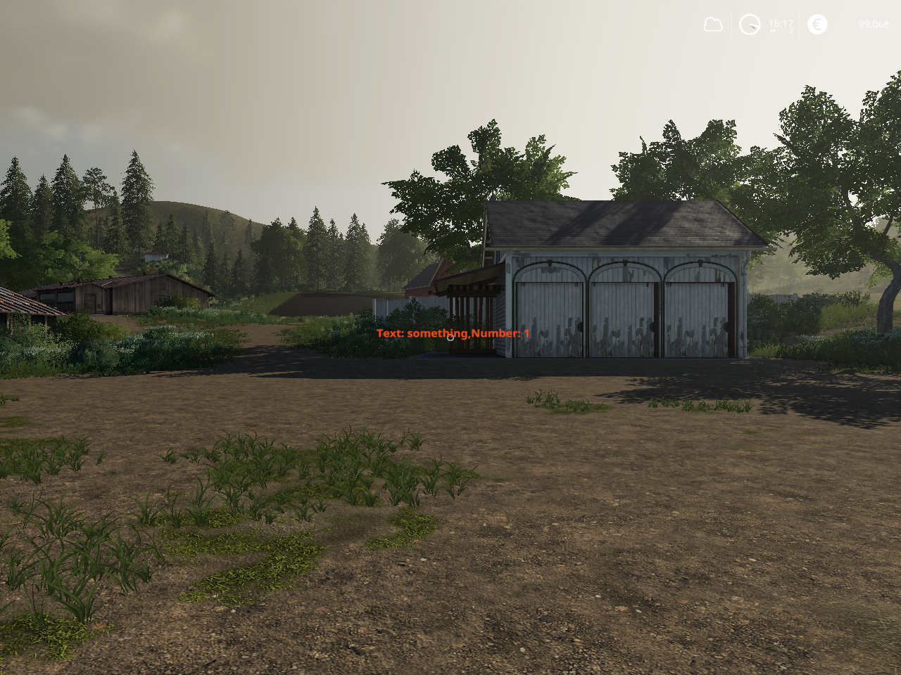

## F19_ComInterface<->CommunicationInterface.exe

##### This script of mod is the for the FS19 communication is with a windows application used tha ram drive.
I wroted in the Lua and C# programming language.<br>



##### Ram drive:<br>
[ImDisk Toolkit](https://sourceforge.net/projects/imdisk-toolkit/). Configuration for your PC<br>

##### CommunicationInterface.exe:<br>
<br>

Current "r:\\" drive on th my PC.<br>
You overwrite if other on the you PC.<br>
In the source file of F19_ComInterface: FS19_mod/source/CommunicationInterface.lua, line 11:<br>
```bash
CommunicationInterface.drive = "r:\\" -- ram drive
```
In the source file of F19_ComInterface: CommunicationInterface/Programs.cs, line 14:<br>
```bash
static public readonly string DRIVER = "r:\\";
```
##### Test file a Visual Studio 2022 C# project:<br>
[Windows Project](CommunicationInterface.sln)<br>
##### FS19 mod zip file:<br>
[Link to](FS19_mod/package)<br>

#### FS19 mod started<br>
<br>

### Features<br>
1.) CommunicationInterface.exe writting Text and Number box, press 'Write' button -><br>
created r:\\AppToFS19.xml file [Link to AppToFS19.xml](drive) -><br>
change focus to the FS19 process -><br>
send soft keyboard event '1'.<br> 
Then F19_ComInterface mod read every two minutes the r:\\AppToFS19.xml file.<br>
Mod is number value incremented by FS-19, than it is drawed the FS19 of center.<br>

2.) FS19 mod created  r:\\FS19ToApp.xml file [Link to AppToFS19.xml](drive) every two minutes -><br>
CommunicationInterface.exe read this xml file, and write the bottom text and number yellow boxs.<br>
 
