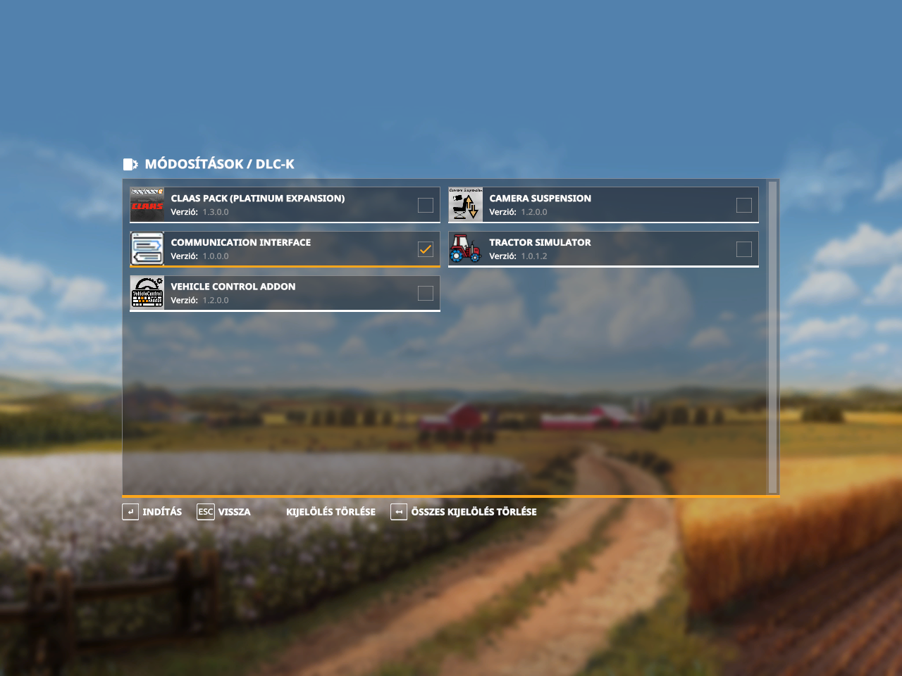

## Farming Simulator 19 mod: F19_ComInterface

##### This script of mod is the for the FS19 communication is with a windows application used tha ram drive.


### Features
##### Ram drive:<br>
<br>
##### CommunicationInterface.exe:<br>
<br>

Current "r:\\" drive on th my PC.<br>
You overwrite if other on the you PC.<br>
In the source file of F19_ComInterface: FS19_mod/source/CommunicationInterface.lua, line 11:<br>
```bash
CommunicationInterface.drive = "r:\\" -- ram drive
```
In the source file of F19_ComInterface: CommunicationInterface/Programs.cs, line 14:<br>
```bash
static public readonly string DRIVER = "r:\\";
```
##### Test file a Visual Studio 2022 C# project:<br>
[Windows Project](CommunicationInterface.sln)<br>
##### FS19 mod zip file:<br>
[Link to](FS19_mod/package)<br>

#### FS19 mod started


